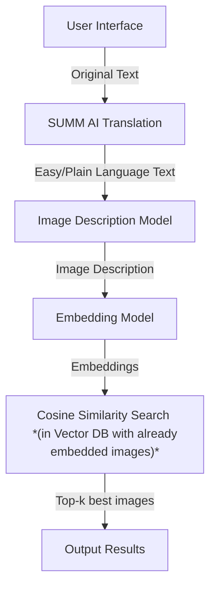

# Text-based Image Search Pipeline

**Pipeline to search Easy Language Images (Leichte Sprache Bilder)**


## **Table of Contents**
1. [Setup](#setup)
2. [Inference](#inference)
3. [Gradio App](#gradio-app)
4. [Credits](#credits)


## Setup

### Requirements
- python >= 3.9
- Nvidia GPU with at least 12GB VRAM
- git

### Clone the repository
```bash
git clone https://github.com/SUMM-AI-Github/simple-AI-images.git
cd easy-language-images/image-search
```

### Run environment

You can either use Docker container or create a virtual environment to run the application. 

1. **Using Docker (recommended)**
    Copy the .env.example file to .env and fill in your huggingface token (see: [user access tokens](https://huggingface.co/docs/hub/security-tokens)).

    Then run the following command to start the docker container:
    ```bash
    docker compose up --build -d
    ```
    
    When the container is running, you can connect to it with your favorite method (e.g. Visual Studio Code Dev-container extension).

2. **Using virtual environment**

    You can directly run the setup_linux.sh file (for linux), which contains all necessary setup steps from creating the virtual environment, to installing all required libraries and also torch by directly identifying the cuda version of your machine.

    **Linux**

    ```bash
    sudo apt update && sudo apt install -y python3-venv

    chmod +x setup_linux.sh
    bash setup_linux.sh
    ```
    ```bash
    source venv/bin/activate
    ```

### Prepare images

Place all relevant images into the `images` folder. These images will be processed by the pipeline to generate embeddings and match them against user queries (Easy language text).


## Inference

The whole inference pipeline looks like this:

    
The step from _User Interface_ to _Easy/Plain Language Text_ is not part of this pipeline, but still shown for context.  
In this repo you can find the implementation of the steps from _Easy/Plain Language Text_ to _Output Results_.
The pipeline is divided into three main components:  
1. **Image Description Model**: Generates image descriptions from Easy Language text.
2. **Embedding Model (CLIP)**: Creates embeddings for generated image descriptions (and at start for images).  
3. **Vector Database (Qdrant)**: Stores image embeddings and enables efficient vector search.

### 1. Image Description Model

As the input is an Easy Language (Leichte Sprache) paragraph in German, we first need to convert it into a suitable English image description that can be better interpreted by the embedding model. 

Many large language models (LLMs) are likely to work for this case, as the task is designed to be model-agnostic. However, for this example, we will demonstrate using one of the **Llama-3** models provided by Meta Platforms, Inc.  
You can set the model in the `config.json` file under `img_desc_model_id`.  
Currently, it is set to: `meta-llama/Llama-3.2-3B-Instruct` as default.  

As `LLama-3.2-3B-Instruct` is a gated model, you will first need access to it by filling in your details [here](https://huggingface.co/meta-llama/Llama-3.2-3B-Instruct).  
Then, change the file name `.env.example` to `.env` and insert your huggingface token into it.  

The model implementation can be found inside `./utils/el_to_img_desc_llama.py`.  
We already provide an initial suitable system prompt according to the requirements (further iterations on the prompt or trying few-shot prompting might enhance the performance).   

The model is loaded directly onto the GPU (CUDA) if available; otherwise, it defaults to the CPU.

### 2. Embedding Model (CLIP)

We use the **CLIP ViT-L-14** model, developed by OpenAI, to generate embeddings for both images and image descriptions. To load the model, we utilize the `open_clip` library, a popular and efficient implementation for working with CLIP models.  

> **Resource Requirements:**  
> The CLIP ViT-L-14 model requires approximately **12–16GB of (V)RAM** to load and perform inference. Ensure that your system has sufficient GPU/CPU memory available, or consider using a smaller variant of the CLIP model, if necessary. 

### 3. Vector Database (Qdrant)

This project leverages [Qdrant](https://qdrant.tech/) for efficient vector search and storage. Qdrant serves as a high-performance, scalable vector database for embedding and similarity-based retrieval tasks. The integration includes:
- **Dataset Storage**: The embeddings of images and their prompts are stored in Qdrant, enabling quick similarity-based searches.
- **Search Functionality**: The system retrieves embeddings that are most relevant to user-provided queries.
- **Efficient Retrieval**: Qdrant optimizes the retrieval process, ensuring low latency and high accuracy for search tasks.

#### Configuration and Setup:
- Update the **`config.json`** file with your Qdrant instance details (such as host and port).  
- The collection is created automatically by the application if it does not already exist. Key collection parameters include:
  - **Vector Size**: Set to `768` (matching the dimensionality of CLIP embeddings).  
  - **Distance Metric**: Set to `COSINE` for similarity measurement.  

#### Installation and Documentation:  
- For installation and setup instructions, refer to the **[official Qdrant documentation](https://qdrant.tech/documentation/)**.  
- Ensure that your Qdrant instance is running and accessible before starting the application.


## Gradio App

We provide a Gradio app that allows you to easily interact with the entire pipeline through an intuitive interface, as shown in the screenshot below: 


To launch the Gradio app, run the following command:  
```bash
python app.py
```

The app allows users to input text in Easy Language (Leichte Sprache) and click "Search". It generates an image description based on the input and retrieves the top 3 matching images from the image folder.

The entire pipeline is defined in the `app.py` file, which can be customized to suit your specific needs.  


## Credits

The project builds on several outstanding tools and models:

- **[Qdrant](https://qdrant.tech/):** A high-performance vector DB
- **[Llama 3.2](https://huggingface.co/meta-llama/Llama-3.2-3B-Instruct):** A 3B instruction-tuned large language model.  
- **[CLIP ViT-L/14](https://huggingface.co/openai/clip-vit-large-patch14):** A large variant of OpenAI's CLIP model for image and text embeddings.  
